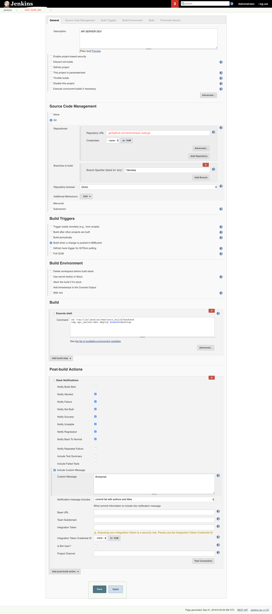

# Install jenkins and configation

## Install
Refer: https://docs.aws.amazon.com/aws-technical-content/latest/jenkins-on-aws/installation.html

Package

- Bitbucket Plugin
- Slack Notification Plugin
- Chatwork Plugin

## Configation

### Setup source auto build on jenkins server
Make sure user [jenkins] connect success to bitbucket

Switch to jenkins user
```sh
sudo su jenkins
```

Add ssh key to project on bitbucket

Make a folder for auto_build

```sh
mkdir -p /var/lib/jenkins/www

cd /var/lib/jenkins/www

git clone git@github.com:binhnxit/auto_build.git
```

Install libs for capistrano: [Refer](../)

And run test build command: 
```sh
cd /var/lib/jenkins/www/auto_build
cap api_server:dev deploy branch=develop
```

Make sure this command run success

### Config jenkins

Login to jenkins service on browser

Install package if need

- Bitbucket Plugin
- Slack Notification Plugin
- Chatwork Plugin
- ...

Setup role access and excute service if need: (Manage Jenkins menu)

Create new project

```
api_server_dev
```

And config as follow




